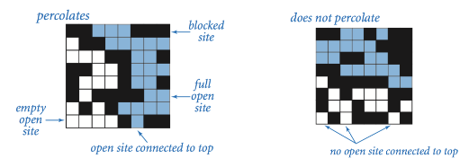

# How to install

See the requirements for your OS here: https://github.com/gopxl/pixel?tab=readme-ov-file#requirements

# How to use

With GUI
```
go run main.go interactive <matrixsize>
```

Without GUI
```
go run main.go run <matrixsize>
```

# What is percolation?

Percolation: given a composite systems comprised of randomly distributed insulating and metallic materials: what fraction of the materials need to be metallic so that the composite system is an electrical conductor? Given a porous landscape with water on the surface (or oil below), under what conditions will the water be able to drain through to the bottom (or the oil to gush through to the surface)? Scientists have defined an abstract process known as percolation to model such situations.

The model. We model a percolation system using an n-by-n grid of sites. Each site is either open or blocked. A full site is an open site that can be connected to an open site in the top row via a chain of neighboring (left, right, up, down) open sites. We say the system percolates if there is a full site in the bottom row. In other words, a system percolates if we fill all open sites connected to the top row and that process fills some open site on the bottom row. (For the insulating/metallic materials example, the open sites correspond to metallic materials, so that a system that percolates has a metallic path from top to bottom, with full sites conducting. For the porous substance example, the open sites correspond to empty space through which water might flow, so that a system that percolates lets water fill open sites, flowing from top to bottom.)

<p align="center">
  
</p>


# What is a weighted quick union with path compression?

Union find is a data structure that connects sets. We are using a particular implementation called weighted quick union with path compression, which has:

Constructor: O(N)
Union: O(log N)
Find: almost O(1)


